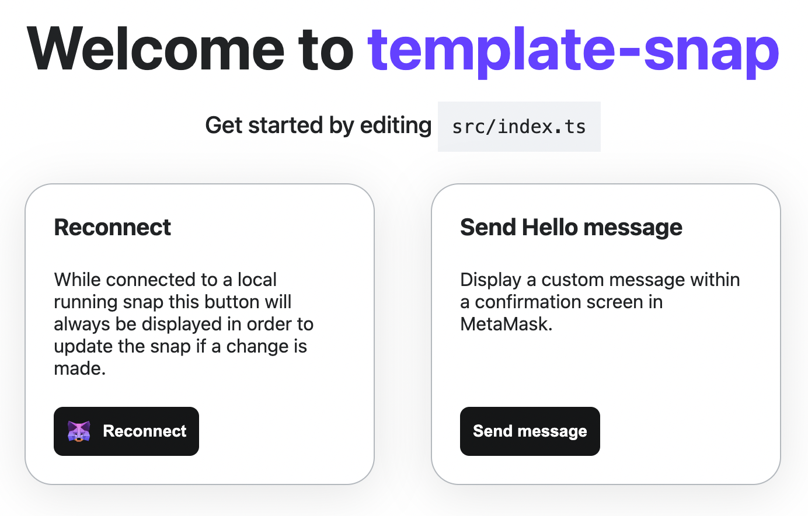
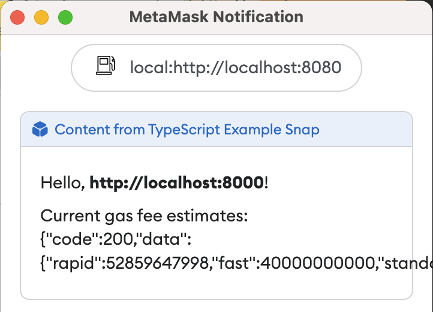

# Create a gas fee snap

This tutorial walks you through creating a snap that estimates gas fees.
The snap is based on the
[Snaps template](https://github.com/MetaMask/template-snap-monorepo), and it requests permissions,
uses the fetch API to request information from the Internet, and displays custom information in a
confirmation dialog.

## Prerequisites

- [Snaps installed](../get-started/install-snaps.md)

  :::note
  Snaps works with the latest LTS version of Node.js, but we recommend using the version specified in
  the template's [`.nvmrc`](https://github.com/MetaMask/template-snap-monorepo/blob/main/.nvmrc) file.
  :::

- A text editor (for example, [VS Code](https://code.visualstudio.com/))

- [Yarn](https://yarnpkg.com/) version 3

## Steps

### 1. Set up the project

Use the Snaps template by
[creating a new repository from the template](https://github.com/MetaMask/template-snap-monorepo/generate).

Give your project a new name, such as `gas-fee-snap`.

[Clone the repository](https://docs.github.com/en/repositories/creating-and-managing-repositories/cloning-a-repository)
using the command line:

```bash
git clone git@github.com:<your-username>/template-snap-monorepo.git
```

To initialize your development environment with the required dependencies, in your project directory,
enter the command `yarn`.

### 2. Set a custom icon

Open the `snap.manifest.json` file in `/packages/snap`.
This file has the main configuration details for your snap.
Edit the section under `npm` to change the `iconPath` to your new icon:

```json title="snap.manifest.json"
"location": {
   "npm": {
      "filePath": "dist/bundle.js",
      "iconPath": "images/gas.svg",
      "packageName": "snap",
      "registry": "https://registry.npmjs.org/"
   }
```

Then, place
[this file](https://raw.githubusercontent.com/Montoya/gas-fee-snap/main/packages/snap/images/gas.svg)
into the `/packages/snap/images` folder.
This is a free icon, **Gas** by Mello from
[Noun Project](https://thenounproject.com/browse/icons/term/gas/).

### 3. Request the network access permission

To enable your snap to use the `fetch` API, request the
[`endowment:network-access`](../reference/permissions.md#endowment--network-access) permission by
modifying `initialPermissions` in `snap.manifest.json`:

```json title="snap.manifest.json"
"initialPermissions": {
  "snap_dialog": {},
  "endowment:rpc": {
    "dapps": true,
    "snaps": false
  }, 
  "endowment:network-access": {}
},
```

### 4. Fetch gas fee estimates

Open `/packages/snap/src/index.ts`.
This is the main code file for your snap.
To get a gas fee estimate, you will use the public API endpoint provided by etherchain.org.
Add the following async function to the top of the file:

```typescript title="index.ts"
import { OnRpcRequestHandler } from '@metamask/snaps-types';
import { panel, text } from '@metamask/snaps-ui';

async function getFees() {
  const response = await fetch('https://beaconcha.in/api/v1/execution/gasnow'); 
  return response.text();
}
```

Then, modify the snap RPC message handler that displays the confirmation window.
This handler uses a switch statement to handle various request methods, but in this case there's
only one method, `hello`.
For this method, the handler returns a call to MetaMask with the parameters to display a
confirmation window, and passes some static strings.

Since the `getFees()` function returns a promise, you must use `then()` to resolve it in your
`hello` method.
Rewrite the `hello` method with the following code:

```typescript title="index.ts"
export const onRpcRequest: OnRpcRequestHandler = ({ origin, request }) => {
  switch (request.method) {
    case 'hello':
      return getFees().then(fees => { 
        return snap.request({
          method: 'snap_dialog', 
          params: { 
            type: 'Alert', 
            content: panel([
              text(`Hello, **${origin}**!`), 
              text(`Current gas fee estimates: ${fees}`), 
            ]), 
          }
        });
      });
```

### 5. Build and test the snap

Open `package.json` in the main directory of the repository, and bump the version (if the version is
`0.1.0`, bump it to `0.2.0`).

From the command line, run `yarn start` to build and test your snap.
You should get a message that includes:

```bash
You can now view site in the browser.

  http://localhost:8000/
```

Your default browser should open and navigate to this address, but if not, open Google Chrome or
Firefox (with MetaMask Flask installed) and navigate to [`localhost:8000`](http://localhost:8000/).
A page like the following displays:



This is a boilerplate test dapp for installing and testing your snap.
Select **Connect** to connect Flask to the dapp.
After connecting, you're prompted to install the snap with the following permissions:

- **Display dialog windows in MetaMask**
- **Allow websites to communicate directly with this snap**
- **Access the internet**

Select **Approve & install**, then **Send Hello**.
A dialog prompt displays with the response from the gas fee API:



Congratulations!
You just integrated a public API into MetaMask and displayed real-time gas fee estimates.

### 6. Next steps

Next, you can try parsing the JSON response from the remote API and displaying the fees in a nicely
formatted way.

You can also update the fields in `snap.manifest.json` to match your custom snap:

- `proposedName` - I used Gas Fee Snap but you can use whatever you prefer
- `description` - up to you
- `repository` - the URL should match your GitHub repo where you cloned the template
- `source` - the `shasum` is set automatically when you build from the command line.
  The location should be based on where it's published on NPM if you decide to publish.

Likewise, you should update the name, version, description, and repository sections of
`package.json` even if you don't plan to publish your snap to NPM.

:::note
The `version` field in `snap.manifest.json` inherits the `version` field from `package.json`.
:::

Lastly, you can update the content of `/packages/site/src/pages/index.tsx`, such as changing the
name of the method for showing gas fee estimates, but make sure to change the method name in
`/packages/snap/src/index.ts` as well to match.
In this repository, the method name has been changed to `fees` and the content of `index.tsx` has
been changed so that the button to invoke it is appropriately labeled **Show Gas Fees**.

Once you have made all these changes you can publish your snap to NPM and make the dapp public so
that others can install and try your custom snap in MetaMask Flask!
