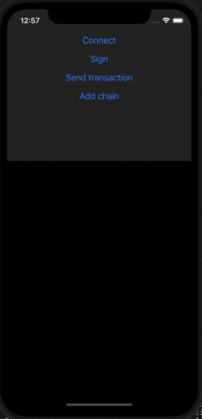

# Use MetaMask SDK

MetaMask SDK provides a reliable, secure, and seamless [connection](../../concepts/sdk-connections.md)
from your dapp to a MetaMask wallet client.
It supports the following dapp platforms:

|             [JavaScript](javascript/index.md)              |           [Mobile](mobile/index.md)           |               [Gaming](gaming/index.md)                |
|:----------------------------------------------------------:|:---------------------------------------------:|:------------------------------------------------------:|
|                [React](javascript/react.md)                |  [React Native](javascript/react-native.md)   |                [Unity](gaming/unity.md)                |
|          [Pure JavaScript](javascript/pure-js.md)          |          [Native iOS](mobile/ios.md)          | [Unreal Engine](gaming/unreal-engine.md) (coming soon) |
| [Other web frameworks](javascript/other-web-frameworks.md) | [Native Android](mobile/ios.md) (coming soon) |                                                        |
|         [React Native](javascript/react-native.md)         |                                               |                                                        |
|              [Node.js](javascript/nodejs.md)               |                                               |                                                        |
|             [Electron](javascript/electron.md)             |                                               |                                                        |

:::note
MetaMask SDK uses the [Ethereum provider](../../reference/provider-api.md) that developers are
already used to, so existing dapps work out of the box with the SDK.
:::

## How it works

<!--tabs-->

# Desktop browser

If a user accesses your web dapp on a desktop browser and doesn't have the MetaMask extension
installed, a popup appears that prompts the user to either install the MetaMask extension or connect
to MetaMask Mobile using a QR code.

You can try the
[hosted test dapp with the SDK installed](https://c0f4f41c-2f55-4863-921b-sdk-docs.github.io/test-dapp-2/).
You can also download the
[React project example](https://github.com/MetaMask/examples/tree/main/metamask-with/metamask-sdk-create-react-app).
Install the example using `yarn` and run it using `yarn start`.

# Mobile browser

If a user accesses your web dapp on a mobile browser, the SDK automatically deeplinks to MetaMask
Mobile (or if the user doesn't already have it, prompts them to install it).
Once the user accepts the connection, they're automatically redirected back to your dapp.
This happens for all actions that need user approval.

You can try the
[hosted test dapp with the SDK installed](https://c0f4f41c-2f55-4863-921b-sdk-docs.github.io/test-dapp-2/).
You can also download the
[React project example](https://github.com/MetaMask/examples/tree/main/metamask-with/metamask-sdk-create-react-app).
Install the example using `yarn` and run it using `yarn start`.

# Node.js

When a user accesses your Node.js dapp, the SDK renders a QR code on the console which users can
scan with their MetaMask Mobile app.

You can download the
[Node.js example](https://c0f4f41c-2f55-4863-921b-sdk-docs.github.io/downloads/nodejs_v0.0.1_beta5.zip).
Install the example using `yarn` and run it using `node .`.

# React Native

When a user accesses your mobile React Native dapp, the SDK automatically deeplinks to MetaMask
Mobile (or if the user doesn't already have it, prompts them to install it).
Once the user accepts the connection, they're automatically redirected back to your dapp.
This happens for all actions that need user approval.

You can download the
[React Native example](https://c0f4f41c-2f55-4863-921b-sdk-docs.github.io/downloads/reactNativeApp_v0.1.0.zip).
Install the example using `yarn setup` and run it using `yarn ios` or `yarn android`.

<!--/tabs-->
